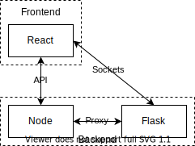

# System overview

The system has a fairly simple design, as depicted in the image below.
The terms frontend and client as well as backend and server will be used interchangeably.

First we have the main server which is written in Python using the micro-framework Flask.
Then have a fairly small Node server who's only function is to serve the React frontend pages.
Lastly we have the frontend which is written in TypeScript using React and Redux.

## Communication

The frontend communicates with the backend in two ways.
All of the following ways are authorized on the server to make sure that who ever tried to communicate has the correct access level.

### API

API calls are used for simple functions the client wants to perform, such as getting, editing and saving data.
These are sent from the client to the backend Node server who will proxy the request to the main Python server.
The request will then be handled there and the response will be sent back.
The Node server will then send them back to the client.

### Sockets

The client can also communicate directly with the server via sockets.
These are suited for fast real time communication.
Thus they are used during an active presentation to sync things between different views such as current slide and timer.
