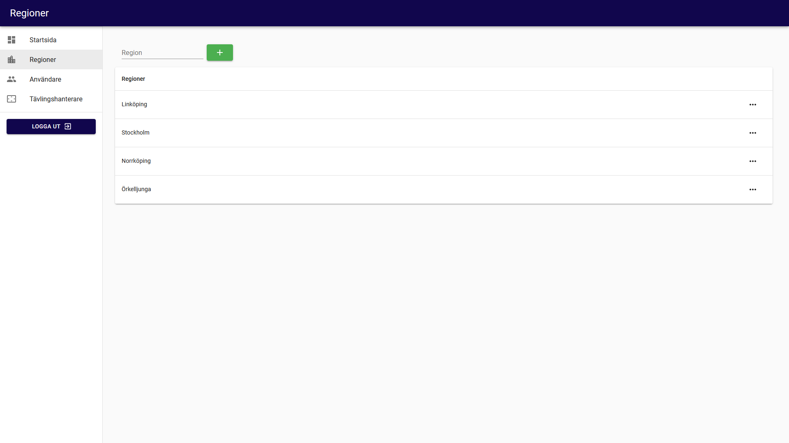

# Admin

After logging in you will see the admin page.
To the left you will see the start page and the competitions tab.
If you are an admin you will also see regions and users.
In the bottom left you will be able to logout by pressing the "Logga ut" button.

## Regions

The regions tab will show all regions.
To create a new region, enter its name at the top and then click the "+" button.

## Users

The users tab will allow you to see all users, their name, region and role.
You will also be able to create new users by clicking the "Ny användare" button.
By clicking the three dots "..." you will be able to edit or delete that user.
You will also be able to search for and filter users by their region or role.

## Competitions

The competitions tab will allow you to see all competitions, their name, region and year.
You will also be able to create a new competition by clicking the "Ny tävling" button or edit existing ones by clicking on their name.
By click on the three dots "..." you will be able to start, show the codes for, copy or delete that competition.

### Competition codes

By pressing the three dots "..." for a competition and then pressing "Visa koder", all the codes for that competition will be shown.
Here you will see what view each code is associated with and what the code is.
You will also be able to generate a new code, copy the code or copy a link to the code that will let others join, or even host, a competition directly.

