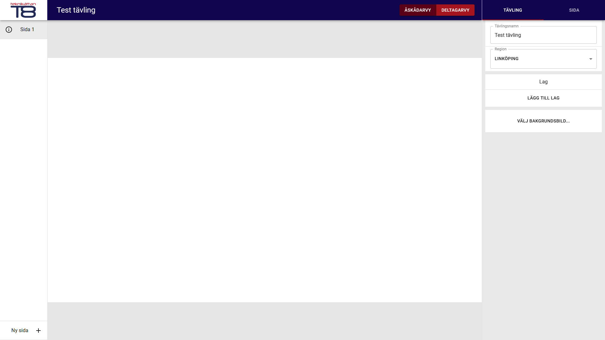
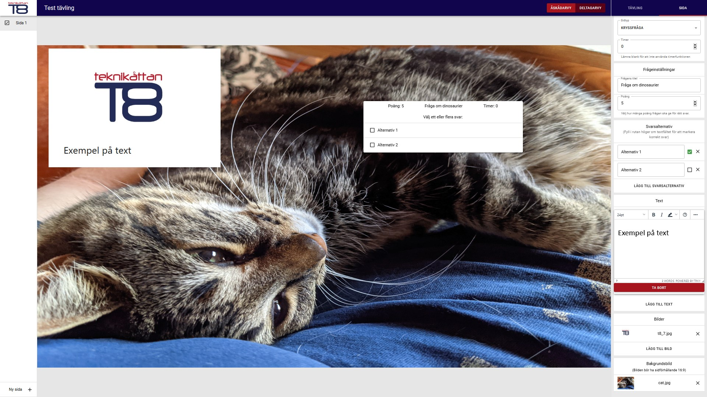

# Editor

After clicking on a competition name you will enter the editor and will be able to edit it.
The Teknikåttan logo in the top left corner will take you back to the Admin page.
To the left you will see all slides, a newly created competition will have one empty default slide.
Switch to a different slide by clicking on it.
In the bottom left corner you will be able to add a new slide.
Delete or copy a slide simply by right clicking on it and choosing the appropriate option.
In the top right corner you will be able to change which view you are see and edit.

## Competition settings

To the right you will see the active tab "Tävling", which will show and let you edit everything about the entire competition.
There you will be able to edit the competition name, add a new team and a background image.
The background image for the competition will be used for all slids in the competition.

## Slide settings

If you choose the "Sida" tab, you will be able to edit the current slide.
In the top right you can change the question type of the current slide.
For all question types you will be able to add a timer for how long the teams have to answer that question.
Depending on which type you choose you will have different options below.
For this example we will choose multiple choice ("Kryssfråga").
For this question type you will have the option to add a title to the question and how much score a correct answer on the question will give.
For this question type you will also be able to add alternatives, which the teams will be able to choose between during a competition.
Below that you will be able to add and remove text and image components as well as a background image.
The background image for the competition can be overridden by explicitly setting one on a specific page.

