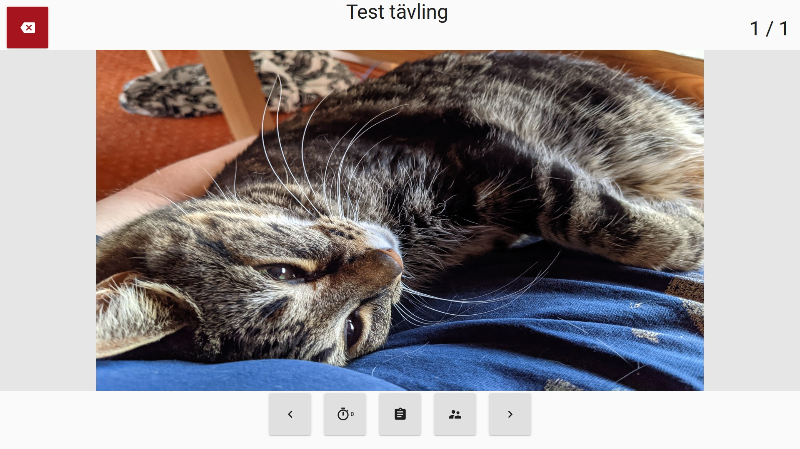
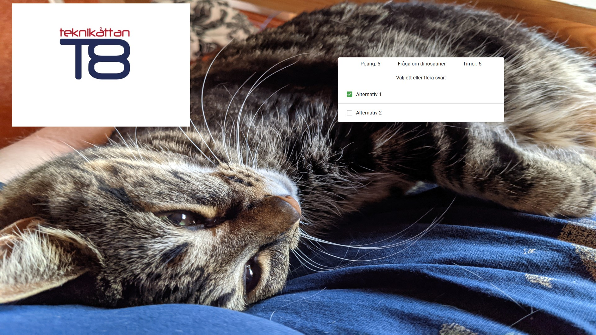
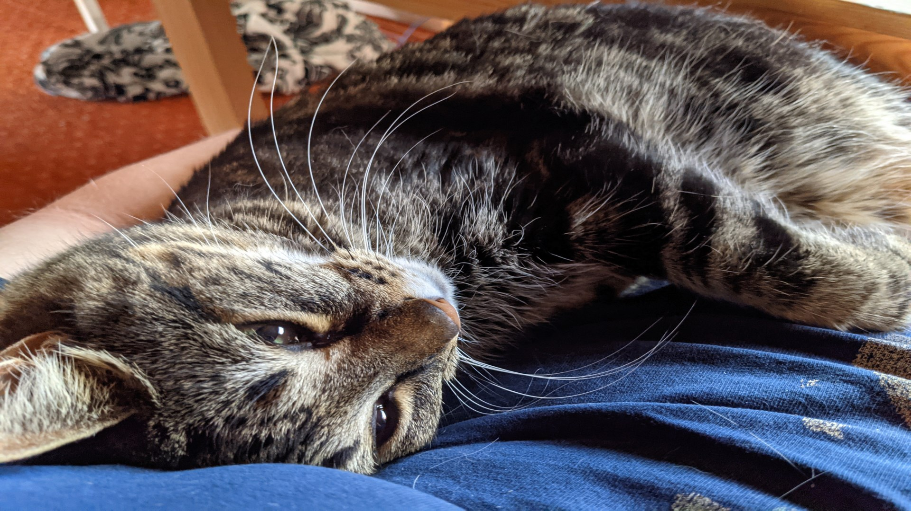
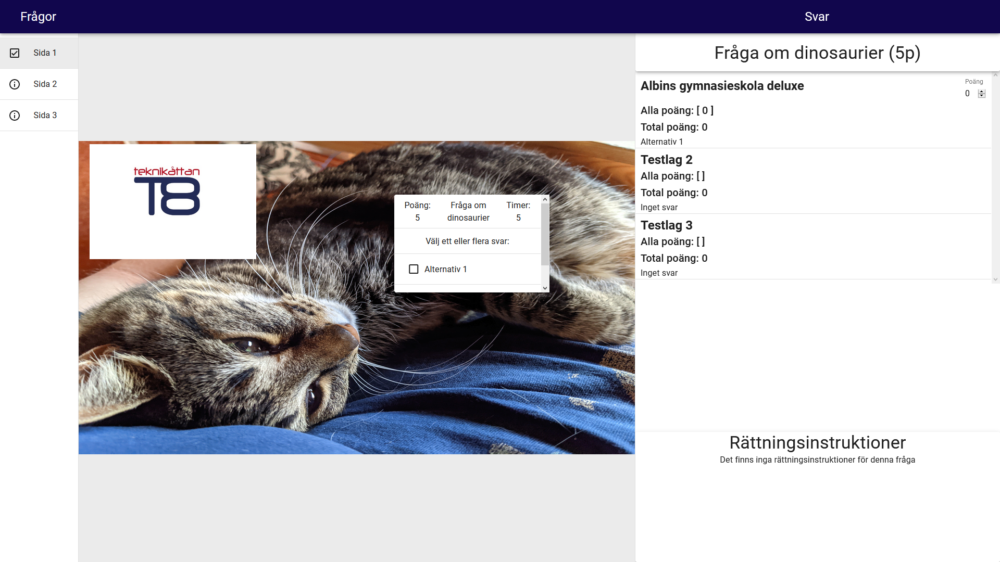

[comment]: # "Why is this file named 'presentation' but the main headline is 'Active competitions'?"

# Active competitions

There are many different views during a competition.
Below it is described how to start a competition, how to join a competition, and how the different kinds of views work.

## Competition codes

You can join a competition with codes.
This can either be done by pasting the link that can be copied when listing the codes or can be typed by hand in the login page.
All the views have different purposes and therefore looks a little bit different from one another.

## Operator

There are two ways to start a competition.
The first way is to navigate to the competition manager, press the three dots "..." and press "Starta".
You will then enter the operator view.
From there you will be able to go between slides with the "<" and ">" buttons or start the timer, both will be synced between all clients connected to that competition.
You will also be able to view the scores for the teams and view all codes to the competition.

## Team

[comment]: # 'What is meant with "(or the code for one of the teams)"? Doesnt a team have to log in using a code?'

The team view (or the code for one of the teams) will be used by teams.
It shows the current slide (that the operator has decided) and allows the user to answer questions on the slide that will be saved.

## Audience

The audience view will look like the operator view but without the buttons.

## Judge

[comment]: # 'Update image to show that the current slide is highlighted.'

The judge view will show show the same slide as team view.
To the left you will be able to move between different slides without affecting the other clients and will be shown och which slide the operator currently is.
To the right you will see what the teams have answered on every question, what score each team got on each question, their total score and be able to set the score of a team on any and all questions.
In the bottom right you will see instructions for how to grade the current question.

